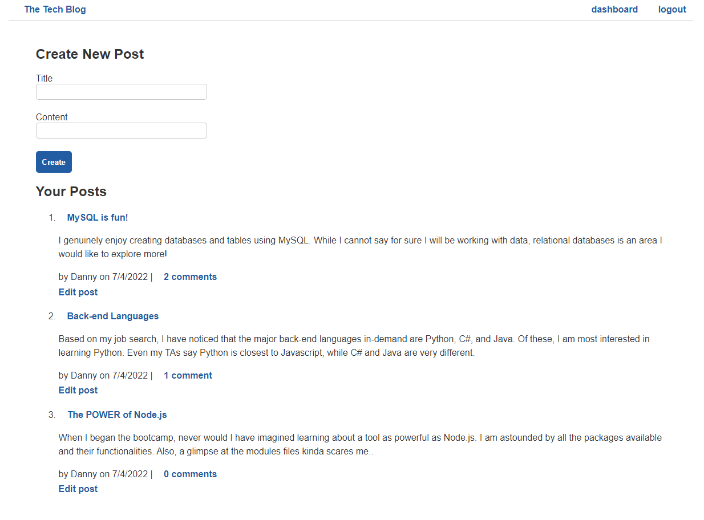

# MVC Tech Blog Challenge

The purpose of this assignment was to apply a Model-View-Controller framework in the creation of a full-stack application.  In particularly, this tested our ability to apply a new package called Handlebars, a templating engine that allows developers to dynamically generate HTML and seamlessly connect frontend and backend functionality. We also gained more experience utilizing a MySQL database along with its corresponding packages such as Sequelize, and expanded our ability to authentic users.

## Description

The Tech Blog is a full-stack, end-to-end application that enables users to create blog posts and share them with a community of other users. Authenticated users are allowed to view and comment on any blog post on the site.  Users are also allowed to update and delete blog posts they have already created.

## Installation/Usage

1. Go to the deployment link at: https://gorgeous-olympic-40961.herokuapp.com/

2. Click on the "login" button on the navigation bar, which is on the top-right of the screen.

3. If it is your first time using the site, sign-up using the 2nd form. Make sure to provide a username and a password. Once you click the "signup" button, you will be sent to the dashboard, where you can create a blog post.

4. If you already have a username and password, add them to the login form and click "login".

5. In order to create a blog post, add text to the Title and Content fields on the dashboard page.

6. If you would like to edit your post, click on the "Edit post" button beneath your post content wthin the "Your Posts" column.  This will send you to a new page, where you may edit the title or content of your post, or delete your post.

6. If you want to view other people's posts, click on "The Tech Blog" button on the top left to be directed to the homepage. There, you will see the title and content, as well as post date and number of comments for other people's posts.

7. In order to add a comment, you may click on either the title or the comment buttons, which are both colored and bolded. This will send you to a new page, where you may add a comment in the text field.

8. You are allowed to comment on your own post.

9. In order to logout, simply click on the "logout" button on the upper right corner.

## Reflection

This challenge really brings many elements of our course together. Starting from the back-end, the Model, we rely on MySQL and the Sequelize package to establish a database and connect it with the rest of the code.  Then we have the Controller, the Express routes that transfer information back and forth between the database and the front-end of the application. Finally, we have our latest addition to the repertoire, Handlebars.js, which is used to create the View, or the front-end layout of the application.  All the while, we have various Node.js functionalities, Javascript logic, and even HTML/CSS files filing in the details to make everything seamlessly work.

Overall, an enjoyable challenge that relied on a full-stack knowledge. Also, I was able to lean on the module to help out due to its similarity with the challenge.